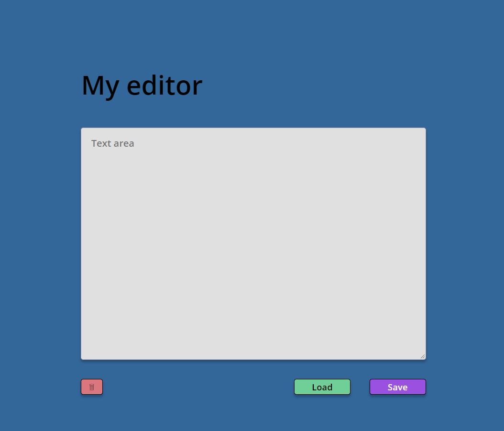

# Simply editor

## Tabel of contents

- [General info](#general-info)
- [Technologies](#technologies)
- [Setup](#setup)
- [Demo](#demo)
- [Features](#features)
- [To-do list](#to-do-list)
- [Status](#status)
- [Sources](#sources)
- [Contact](#contact)

## General info

This project is being developed in progress of course **_WTF: Co ten frontend_**.
This project show how to use Local Storage in small example

## Technologies

- HTML 5
- SASS -SCSS
- Vanilla JS
- webpack

## Setup

In console type `npm install` then choose one of the options:

`npm run start` - runs development mode

`npm run build` - runs build process for production

`npm run publish` - runs build process and publish the page using `gh-pages` branch

## Demo

Demo version of this project: [Link](https://skalutki.github.io/Simply-editor2021/)

## Features

- save / load / remove item in Local Storage
- auto refresh web
- flex box

## To-do list:

- add RWD

## Status

Project is: in progress, I'm still learning JS and trying to use new knowledge in practice!

## Sources

This web is inspire by Maciej Korsan and tutorial by [WTF: Co ten frontend](https://cotenfrontend.pl/)

## Contact

Created by skalutki <skalutki@gmail.com> - feel free to contact me!
